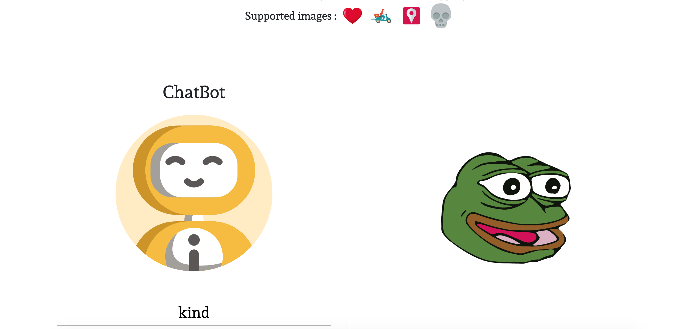
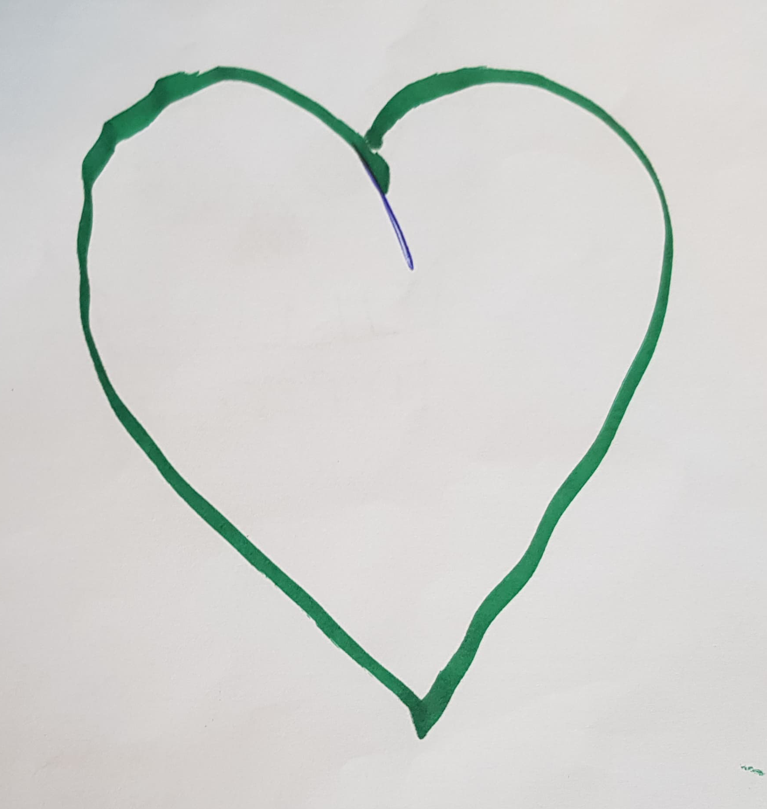
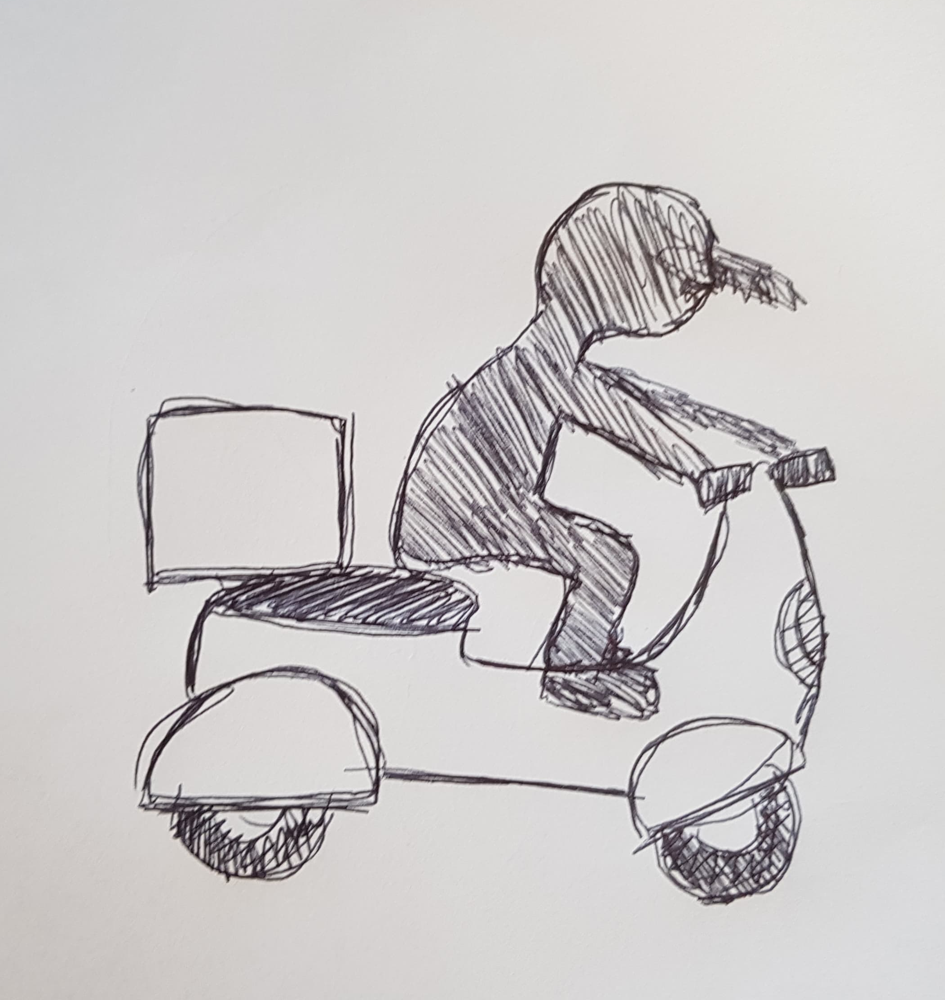
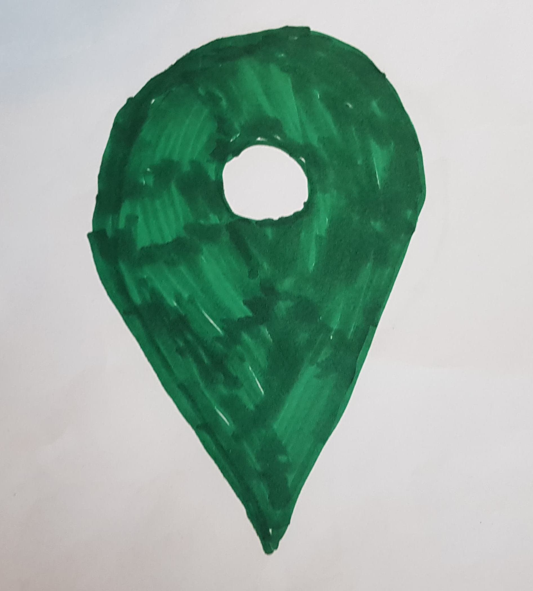

# Be-Burger

Be-Burger is a website that I created and design from scratch as an exercise to learn how to use Bootstrap.

## Preview

### <a href="https://mkaramen.github.io/Be-burger/" width="40%" height="40%" alt=""> Check it out ! </a>

## Responsive

The website is responsive and was designed for mobile first.

## Build With

<ul> 
    <li>HTML</li>
    <li>CSS</li>
    <li>SASS</li>
    <li>Bootstrap</li>
</ul>

## More info

Here is the result after 1 month of training as a junior Web Dev. It took me around 5 days to design and creat the entire website.

### Credit

All images used are copyright free.

Sources :

<ul>
    <li><a href="https://unsplash.com/">Unsplash</a></li>
    <li><a href="https://pixabay.com/">Pixabay</a></li>
    <li><a href="https://www.canva.com/create/logos/">Canva</a></li>
</ul>

### Author

Matis Karamenderes
10 september 2019

## 14 november 2019

# New Features

Added a chatbot where the client can ask questions about the restaurant.
The chatbot also recognize a few images and responds to them.

## Preview

## New technologies used

<ul>
    <li>RiveScript</li>
    <li>Teachable Machine</li>
    <li>p5</li>
</ul>

## About the AI

I trained the AI with 50 images of each type, the results are pretty good. After the traning I tried to make the AI reconize drawings it didn't know. The results where great it worked 90% of the time. Here are the images I used :

## More info

It was my first time using a neural newtork, it was a very interesting experience I had to learn more about the way it learns and how it works in order to make mine works.
