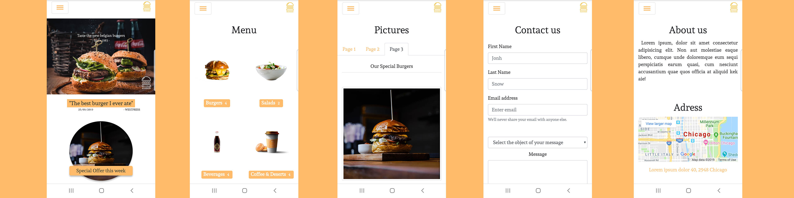

# Be-Burger

Be-Burger is a website that I created and design from scratch as an exercise to learn how to use Bootstrap.

## Preview

### <a href="https://mkaramen.github.io/restaurant-css-framework/" width="40%" height="40%" alt=""> Check it out ! </a>

## Responsive

The website is responsive and was designed for mobile first.

## Build With

<ul> 
    <li>HTML</li>
    <li>CSS</li>
    <li>SASS</li>
    <li>Bootstrap</li>
</ul>

## More info

Here is the result after 1 month of training as a junior Web Dev. It took me around 5 days to design and creat the entire website.

### Credit

All images used are copyright free.

Sources :

<ul>
    <li><a href="https://unsplash.com/">Unsplash</a></li>
    <li><a href="https://pixabay.com/">Pixabay</a></li>
    <li><a href="https://www.canva.com/create/logos/">Canva</a></li>
</ul>

### Author

Matis Karamenderes
10 september 2019
